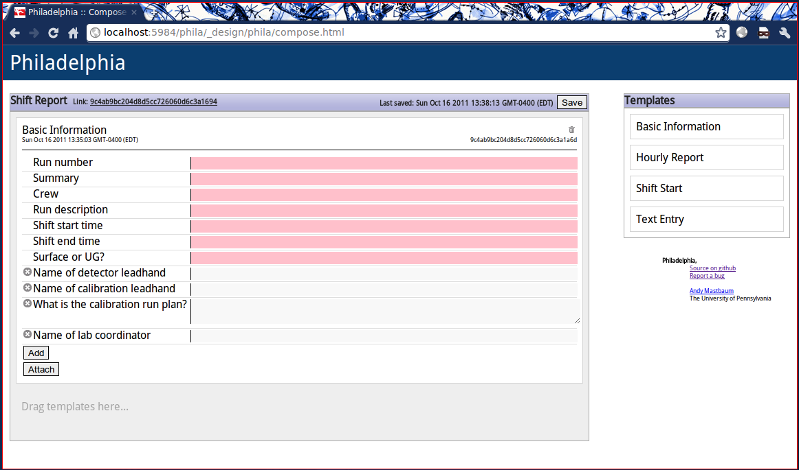
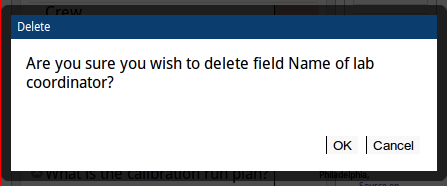
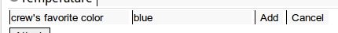
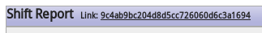

The Report Composition Page
===========================


Composing a Report
``````````````````
To compose a report, click and drag templates from the right into the report area ("Drag templates here..."). Once dropped, the templates can be re-arranged by dragging and dropping.

.. image:: _static/compose_drag_drop.png
    :scale: 50%

Fields marked as required by the shift report administrator appear with a red background when empty and cannot be removed.

Removing Fields
```````````````
To remove a field or attachment, click the X to the left of the field name. You will be asked to confirm.



Adding New Fields
`````````````````
To add a new field, click "Add" at the bottom of the list of fields. Enter a field name and a value, then click "Add" or press Enter. 



Adding Attachments
``````````````````
To attach a file to your shift report, click "Attach" at the bottom of the list of fields. Choose a file, then click "Upload." 

Saving
``````
The report is automatically saved every 10 seconds and when you leave the page. You may also save at any time by clicking the "Save" button in the upper right corner of the report area.

Removing a Block
````````````````
To remove a block from your report, click the trash can icon in the upper right corner of the block. Note that this operation is irreversible.

Remote Assistance
`````````````````
If you need help with a shift report, ask an expert. Send them the link at the top of the page, and they can see your report in real time as you modify it.



