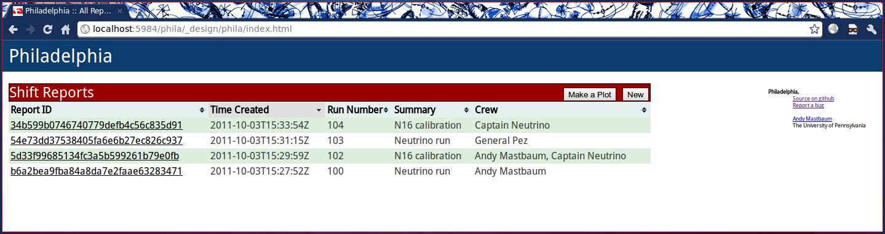

The Index Page
==============

The index page provides a list of all past shift reports. By default, it is sorted by date (newest first), but clicking on the column headers allows sorting by anything.

Clicking on a report ID will take you to that shift report.

There are two buttons in the upper right of the report list: "Make a Plot" and "New." Clicking "New" takes you to the report composition page.

