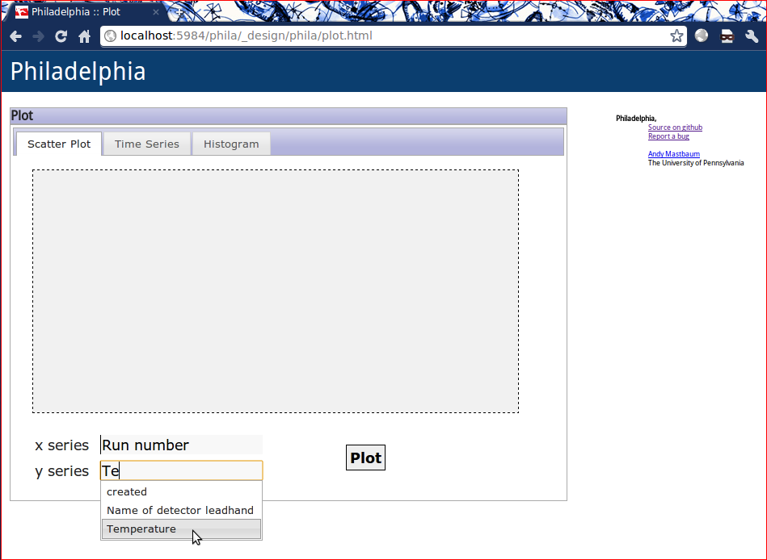
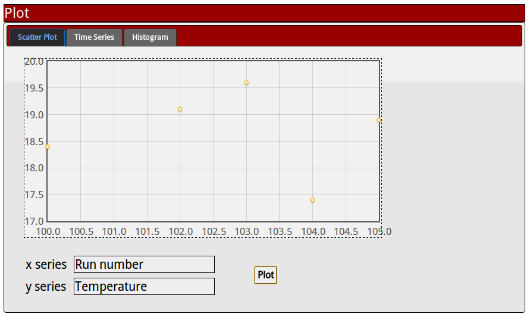
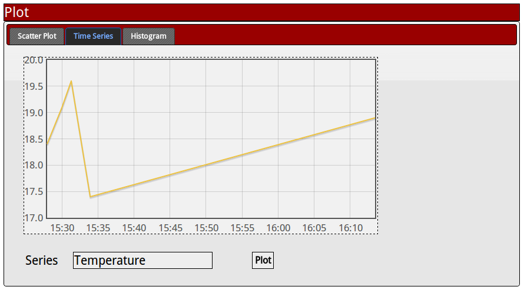
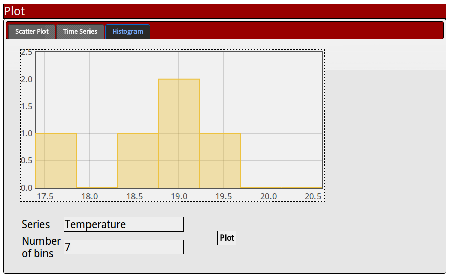

The Plotting Page
=================


Philadelphia includes a built-in interface for plotting the data stored in shift reports. Currently, it supports scatter plots, time series, and histograms of numerical fields. All fields are plottable, including any added by users. Since field names are arbitary, all fields for entry of a series name autocomplete with valid field names.

Scatter Plots
`````````````
Enter an X series (e.g. "Run number") and a Y series (e.g. "Temperature") to create a scatter plot.



Time Series
```````````
Enter a series name (e.g. "Temperature") to plot the history of that value over time.



Histograms
``````````
Enter a series name (e.g. "Temperature") and the desired number of bins to create a histogram.



